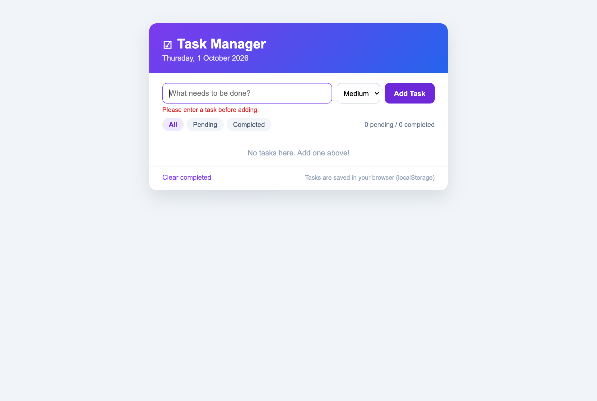
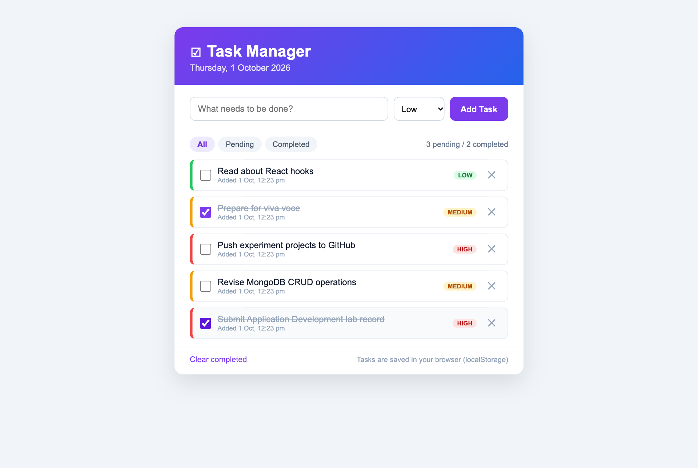
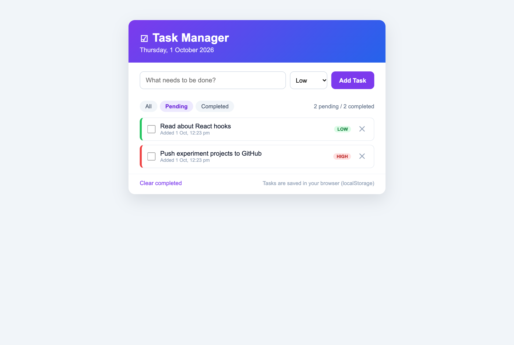
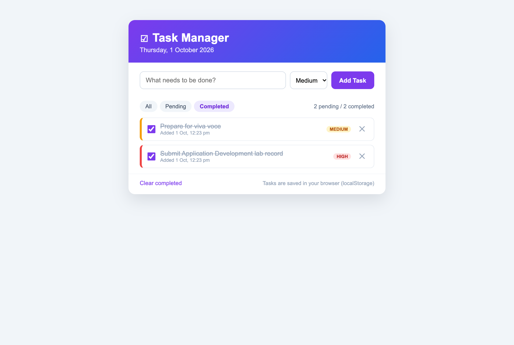

# Task Management Application using JavaScript

> **Application Development Laboratory (U21AD502) — Experiment 03**
> Prepared by **Nakul T (24AD068)**, Department of Artificial Intelligence and Data Science, KPR Institute of Engineering and Technology.

## Project Overview

A to-do / task manager web application written in plain JavaScript. Users can add tasks with a priority, mark them as completed, delete them, filter the list and clear completed tasks. All tasks are saved in the browser's localStorage so they persist between sessions.

**Aim:** To develop a JavaScript application to manage tasks by entering tasks to be done, marking them once they are done and deleting them if they are no longer needed.

## Features

- Add tasks with Low / Medium / High priority
- Validation against empty and duplicate pending tasks
- Mark tasks as completed by clicking the checkbox or task text (strike-through style)
- Delete individual tasks and clear all completed tasks
- Filter by All, Pending and Completed with a live pending/completed counter
- Colour-coded priority badges and borders, creation timestamp on each task
- Persistence with localStorage – tasks survive page reloads
- Event delegation: a single listener handles every task's actions

## Tech Stack

| Layer | Technology |
|---|---|
| Markup | HTML5 |
| Styling | CSS3 |
| Logic | Vanilla JavaScript (ES6+, DOM API) |
| Storage | Web Storage API (localStorage) |

## Folder Structure

```
exp03-task-manager-js/
├── .gitignore
├── LICENSE
├── README.md
├── css/
│   └── style.css
├── index.html
├── js/
│   └── app.js
└── screenshots/   (output screenshots)
```

## Setup and Installation

1. Clone the repository: `git clone https://github.com/nakultt/exp03-task-manager-js.git`
2. Open the folder: `cd exp03-task-manager-js`
3. No dependencies are required.

## How to Run

Open `index.html` in a browser (or run `npx serve .`). Add a few tasks, tick some as completed, delete one and reload the page to see that the tasks are persisted.

## Screenshots

### 1. Validation message when adding an empty task



### 2. Tasks added with different priorities


### 3. Tasks marked as completed (strike-through)



### 4. After deleting a task – Pending filter applied



### 5. After page reload – tasks persisted in localStorage (Completed filter)



## Result

The project was successfully developed and executed, and the output was verified.

## Author

**Nakul T** — 24AD068 · B.Tech Artificial Intelligence and Data Science · [github.com/nakultt](https://github.com/nakultt)
